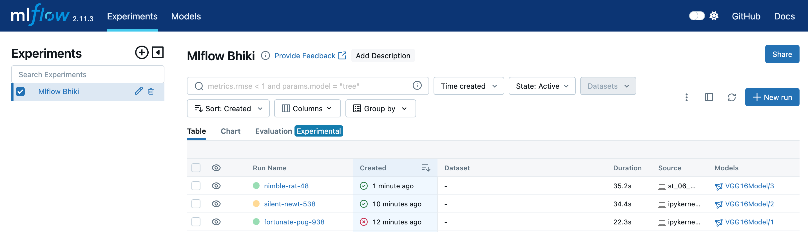
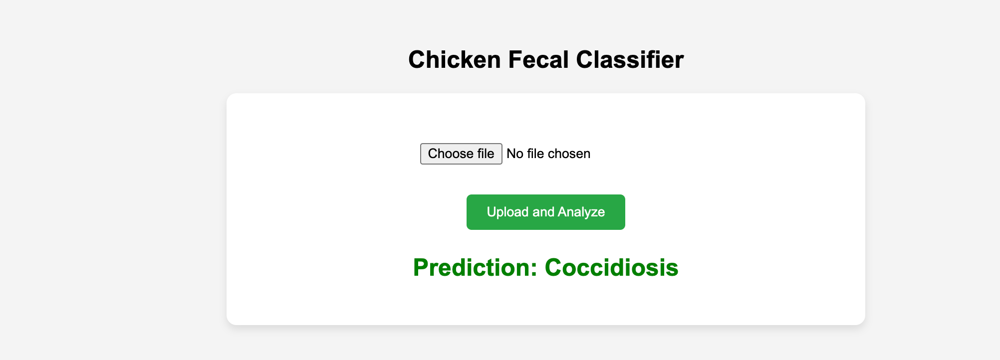

# Chicken_fecal

1. Create an ENV
conda create -n chkn python=3.12 -y
2. activate the env
cmd: conda activate chkn
3. create an temp.py
cmd: touch temp.py -> having project str
4. create requirements.txt
cmd: touch requirements.txt
cmd: pip install -r requirements.txt
5. declare src as a package
setup.py
6. Data Ingestion EXP and modular coding added
7. Splitting the data set and modualr coding added
8. Data Aug exp and modeular coding added
9. model building exp and modular coding added
10. model call beck exp done
11. model train with callback and data aug
12. Model evaluation
13. Test the model
# Watch dog is a lib that will track the .py file if their is any chnages has been made and save then it will trigger the entire pipeline
14. Now added the DVC yaml file for model retraining if any code changes in the existing code
# DVC cmds
1. dvc init
2. dvc status
3. dvc dag
4. dvc repro
### Additionally i have added the main method for each pipeline class to run the dvc repro
15. git hooks -> it will check the code changes if found then run the dvc repro before commit
## git hook cmds
1. cd .git/hooks
2. nano pre-commit
save ->control+o, press enter then control+x for exist
3.#!/bin/bash

echo "Pre-commit hook triggered."
dvc repro
status=$?
##### Check if dvc repro succeeded
if [ $status -ne 0 ]; then
    echo "dvc repro failed with status $status. Commit aborted."
    exit 1  # Abort the commit
else
    echo "dvc repro completed successfully."
fi
[here i did not check the dvc status i just dvc repro every time before commit any chnages into the git]
4. chmod +x pre-commit
5. git add . && git commit -m "Test commit"

16. Mlflow added

17. index.html and flask added and run successfully

Note: -> 
    we will get the file after executing 
    file = request.files['file']

    # this will convert the live file into an image
    image = Image.open(file.stream)

    then we can not do the pre-process with so we need to convert it to array
    image = img_to_array(image)

    then normal process like normalize and reshape the image
    image = image/255.0
    image = image.reshape((1,224,224,3))

Note2: -> Key Points:
reshape: [here we need to define/ tell that the its a one picture or multiple ] 

You specify the new shape explicitly, including all dimensions (e.g., (1, 224, 224, 3)).
You have to know and provide the correct dimensions.

np.expand_dims: [here it will take automatically(height,width,channels) as we provide the input phase] 

You just tell it which axis to add a new dimension to (e.g., axis=0 for the batch dimension).
It automatically adjusts the shape to add that new dimension without needing to specify the others.
So, expand_dims is often more convenient when you just want to add a batch dimension!

    

# Why Freeze VGG16 Layers?
Imagine you have a smart, trained dog named VGG16 who is really good at recognizing various objects in pictures (like cats, dogs, and cars) because it has been trained on thousands of images.

Now, suppose you want to use VGG16 to help recognize different types of fruits in pictures. Instead of starting from scratch and training a new dog to recognize fruits, you can:

Use VGG16’s Knowledge: VGG16 already knows a lot about identifying different patterns in images.
Teach It a New Task: You only need to teach VGG16 about fruits, which is a smaller task.
Steps to Use VGG16 for Fruit Recognition
Use the Trained Dog (VGG16):

VGG16 is like your well-trained dog that can recognize general patterns. You don’t want to change what it has already learned.
Freeze Its Skills:

You decide that you don’t want to retrain your dog’s general skills because it’s already good at it. So, you "freeze" its knowledge. This means you keep its existing skills as they are.
Add New Training:

You add a new task for VGG16, like recognizing fruits. You create new training for this specific task, using only the new knowledge (layers) that you add on top of the frozen skills.

# Workflows
 1. Update config.yaml
here we will store the config things example data set path to get the data/store the data etc
2. Update params.yaml
3. Update entity
entity is nothing but the return type of a function
entity where we just store the data paths only, once configuration manager will execute then it will return the and store the data as per the entity data storage path
4. Update the configuration manager in src config
configuration manager where we will read the config/params yaml and and return the data to the entity folder, this will used in pipeline 
5. update the components
this .py file will zip unzip the data and store the data into the respective folder, once the configuration manager will execute then it will return the and store the data as per the entity data storage path
6. update the pipeline

7. update the main.py
to run the pipe line we need write the pieace of code
8. update the app.py

