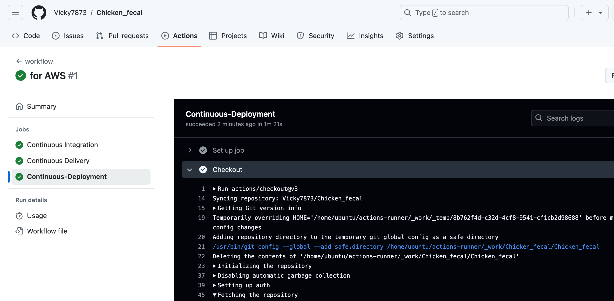
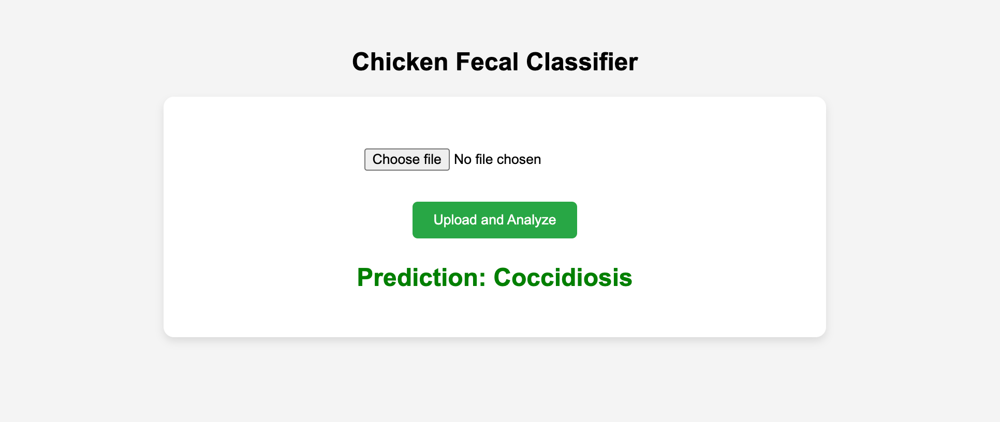
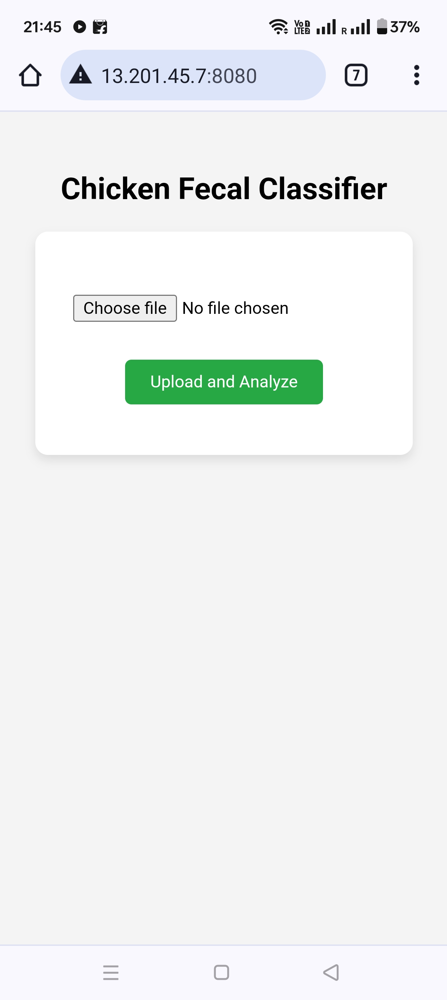

# Chicken_fecal

1. Create an ENV
conda create -n chkn python=3.12 -y
2. activate the env
cmd: conda activate chkn
3. create an temp.py
cmd: touch temp.py -> having project str
4. create requirements.txt
cmd: touch requirements.txt
cmd: pip install -r requirements.txt
5. declare src as a package
setup.py
6. Data Ingestion EXP and modular coding added
7. Splitting the data set and modualr coding added
8. Data Aug exp and modeular coding added
9. model building exp and modular coding added
10. model call beck exp done
11. model train with callback and data aug
12. Model evaluation
13. Test the model
# Watch dog is a lib that will track the .py file if their is any chnages has been made and save then it will trigger the entire pipeline
14. Now added the DVC yaml file for model retraining if any code changes in the existing code
# DVC cmds
1. dvc init
2. dvc status
3. dvc dag
4. dvc repro

15. git hooks -> it will check the code changes if found then run the dvc repro before commit
## git hook cmds
1. cd .git/hooks
2. nano pre-commit
save ->control+o, press enter then control+x for exist
3.#!/bin/bash

echo "Pre-commit hook triggered."
dvc repro
status=$?
##### Check if dvc repro succeeded
if [ $status -ne 0 ]; then
    echo "dvc repro failed with status $status. Commit aborted."
    exit 1  # Abort the commit
else
    echo "dvc repro completed successfully."
fi
[here i did not check the dvc status i just dvc repro every time before commit any chnages into the git]
4. chmod +x pre-commit
5. git add . && git commit -m "Test commit"

16. Mlflow added

17. index.html and flask added and run successfully

# Workflows
 1. Update config.yaml
here we will store the config things example data set path to get the data/store the data etc
2. Update params.yaml
3. Update entity
entity is nothing but the return type of a function
entity where we just store the data paths only, once configuration manager will execute then it will return the and store the data as per the entity data storage path
4. Update the configuration manager in src config
configuration manager where we will read the config/params yaml and and return the data to the entity folder, this will used in pipeline 
5. update the components
this .py file will zip unzip the data and store the data into the respective folder, once the configuration manager will execute then it will return the and store the data as per the entity data storage path
6. update the pipeline

7. update the main.py
to run the pipe line we need write the pieace of code
8. update the app.py

# Dockerize 
### run this project in local docker
1. docker build -t cfc .
cfc is my docker image name
2. docker run -p 8080:8080 cfc

# 1. Login to AWS console.
# 2. Create IAM user for deployment

#with specific access

1. EC2 access : It is virtual machine

2. ECR: Elastic Container registry to save your docker image in aws

#Description: About the deployment

1. Build docker image of the source code

2. Push your docker image to ECR

3. Launch Your EC2 

4. Pull Your image from ECR in EC2

5. Lauch your docker image in EC2

# Policy:

1. AmazonEC2ContainerRegistryFullAccess

2. AmazonEC2FullAccess
3. Create ECR repo to store/save docker image
- Save the URI: 566373416292.dkr.ecr.us-east-1.amazonaws.com/text-s
4. Create EC2 machine (Ubuntu)
5. Open EC2 and Install docker in EC2 Machine:
#optinal

sudo apt-get update -y

sudo apt-get upgrade

#required

curl -fsSL https://get.docker.com -o get-docker.sh

sudo sh get-docker.sh

sudo usermod -aG docker ubuntu

newgrp docker
# 6. Configure EC2 as self-hosted runner:
setting>actions>runner>new self hosted runner> choose os> then run command one by one
# 7. Setup github secrets:
AWS_ACCESS_KEY_ID=

AWS_SECRET_ACCESS_KEY=

AWS_REGION = us-east-1

AWS_ECR_LOGIN_URI = demo>>  566373416292.dkr.ecr.ap-south-1.amazonaws.com

ECR_REPOSITORY_NAME = simple-app

on desktop

on mobile

